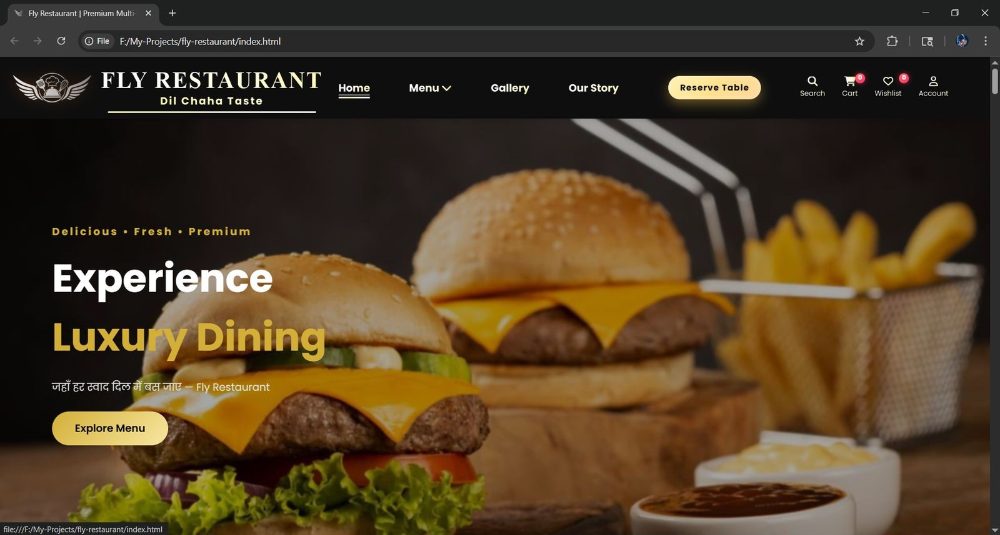
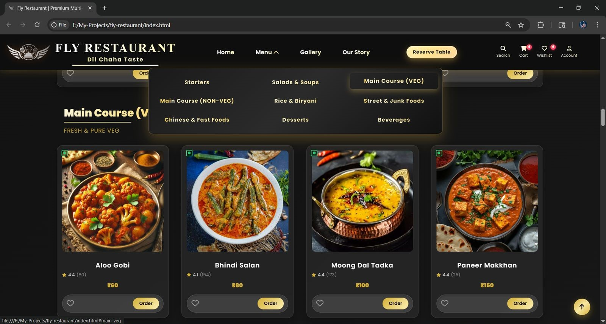
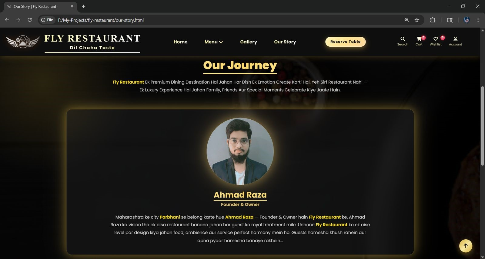
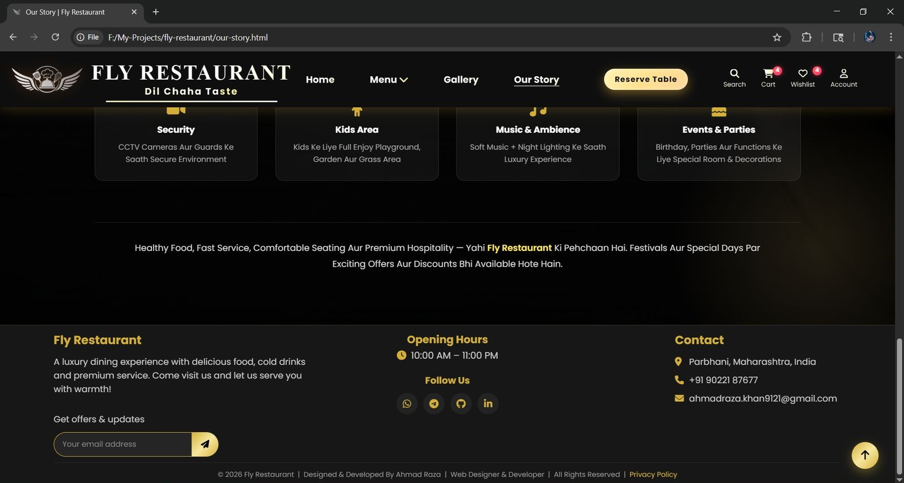

# 🍽️ Fly Restaurant — Restaurant Website

A modern, fully responsive restaurant website built from scratch using vanilla HTML5, CSS3, and JavaScript. It includes a digital menu, WhatsApp-based ordering, table reservation features, and a clean professional user experience.

## 🔗 Links
- **Live Demo:** [Add your live demo link]
- **Portfolio:** [Add your portfolio link]
- **GitHub Repository:** [Add your repository link]

## 📸 Showcase & Interface Preview

<p align="center">
  <i>A visual walk-through of the dining interface, interactive menu listings, brand story, and navigation built for <b>Fly-Restaurant</b>.</i>
</p>

---

### 🏠 01. Homepage & Hero Landing Section
> *Features the main welcome banner, table reservation triggers, call-to-action buttons, and core branding aesthetics.*

<div align="center">
  
</div>

<br>

### 🍽️ 02. Interactive Food & Beverages Menu
> *Showcases categorized menu items (veg, non-veg, beverages, desserts) complete with pricing, descriptions, and dynamic cart integration.*

<div align="center">
  
</div>

<br>

### 📖 03. Our Story & Culinary Vision
> *Highlights the restaurant's journey, chef specialities, quality standards, and authentic dining philosophy.*

<div align="center">
  
</div>

<br>

### 🦶 04. Footer & Contact Details
> *Displays opening hours, location/address details, quick navigation links, social media channels, and support info.*

<div align="center">
  
</div>

---

## ✨ Features
- 76-item digital menu across 9 categories
- Veg / Non-Veg filter for faster browsing
- Cart and wishlist with persistent state
- WhatsApp-integrated ordering
- Table reservation system with date, time, and guest count
- Interactive gallery
- Item detail view with descriptions and ratings
- Demo login/register modal
- Fully responsive layout
- SEO optimized with meta tags, Open Graph, JSON-LD, `sitemap.xml`, and `robots.txt`
- PWA support via `manifest.json`
- Performance optimized images and lazy loading
- Accessibility-friendly navigation and visible focus states
- Privacy policy and custom 404 pages

## 🛠️ Tech Stack
- HTML5
- CSS3
- JavaScript (ES6+)
- LocalStorage
- Git & GitHub

## 📁 Project Structure

```bash
fly-restaurant/
├── .vscode/
├── assets/             # Main directory for all media assets and static files
│   │          
│   ├── favicon/        # Multi-resolution favicons for browser tabs & devices
│   │   ├── apple-touch-icon.png
│   │   ├── favicon-16x16.png
│   │   ├── favicon-32x32.png
│   │   ├── favicon-512.png
│   │   └── favicon.ico
│   │
│   ├── images/         # Food menu items, category images & media assets
│   │   ├── beverages/                  # Drinks & beverage menu images
│   │   ├── chinese & fast foods/       # Chinese & fast food item images
│   │   ├── desserts/                   # Sweet treats & dessert images
│   │   ├── gallery/                    # Restaurant Exterior, interior & food gallery photos
│   │   ├── hero/                       # Hero section banners & showcase graphics
│   │   ├── main(non-veg)/              # Non-vegetarian main course images
│   │   ├── main(veg)/                  # Vegetarian main course images
│   │   ├── rice & biryani/             # Rice & biryani dishes images
│   │   ├── salads/                     # Fresh salad images
│   │   ├── starters/                   # Appetizers & starters images
│   │   ├── street, junk & more/        # Street food & snack item images
│   │   └── banner-story.jpg            # About/Our Story banner image
│   │
│   ├── project/        # Portfolio screenshots & project preview assets
│   │   ├── fly-restaurant-footer-section.jpg
│   │   ├── fly-restaurant-home-page.jpg
│   │   ├── fly-restaurant-menus.jpg
│   │   └── fly-restaurant-our-story.jpg
│   │
│   ├── fly-restaurant-logo.png     # Official restaurant brand logo
│   └── profile.jpg     # Developer/Author profile picture
│
├── css/        # Cascading Style Sheets for layout & UI styling
│   ├── cart.css
│   ├── contact.css
│   ├── our-story.css
│   ├── responsive.css
│   └── style.css
│
├── js/     # JavaScript logic for interactivity & menu handling
│   ├── cart.js
│   ├── products-data.js
│   └── script.js
│
├── .gitignore
├── 404.html
├── cart.html
├── contact.html
├── CONTRIBUTING.md
├── index.html
├── LICENSE
├── manifest.json
├── our-story.html
├── privacy.html
├── README.md
├── robots.txt
├── SECURITY.md
├── sitemap.xml
└── wishlist.html


👤 Author

Ahmad Raza Khan

Web Developer & Designer

📍 Parbhani, Maharashtra, India

✉️ Email: ahmadraza.khan9121@gmail.com


📄 License & Usage

This project is proprietary and shared for portfolio/demo purposes only.

Note: All rights reserved. No copying, modification, redistribution, re-uploading 
or derivative use is allowed without prior written permission from the author.

Viewing the project is allowed for evaluation only.

See the LICENSE file for full terms.